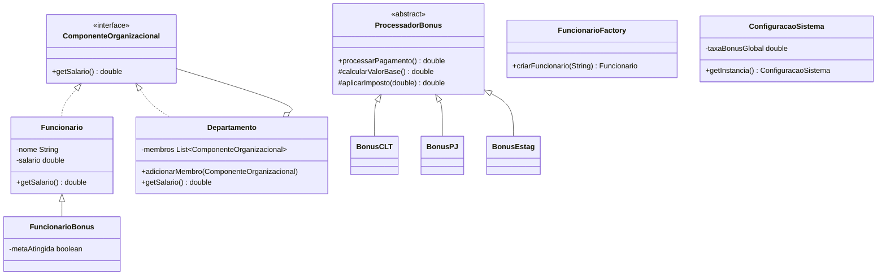

# Diagrama de classes

```mermaid
classDiagram
    class ComponenteOrganizacional {
        <<interface>>
        +getSalario() double
    }
    class Funcionario {
        -nome String
        -salario double
        +getSalario() double
    }
    class FuncionarioBonus {
        -metaAtingida boolean
    }
    class Departamento {
        -membros List~ComponenteOrganizacional~
        +adicionarMembro(ComponenteOrganizacional)
        +getSalario() double
    }
    ComponenteOrganizacional <|.. Funcionario
    ComponenteOrganizacional <|.. Departamento
    Funcionario <|-- FuncionarioBonus
    Departamento o-- ComponenteOrganizacional

    class ProcessadorBonus {
        <<abstract>>
        +processarPagamento() double
        #calcularValorBase() double
        #aplicarImposto(double) double
    }
    class BonusCLT
    class BonusPJ
    class BonusEstag
    ProcessadorBonus <|-- BonusCLT
    ProcessadorBonus <|-- BonusPJ
    ProcessadorBonus <|-- BonusEstag

    class FuncionarioFactory {
        +criarFuncionario(String) Funcionario
    }
    class ConfiguracaoSistema {
        -taxaBonusGlobal double
        +getInstancia() ConfiguracaoSistema
    }
```